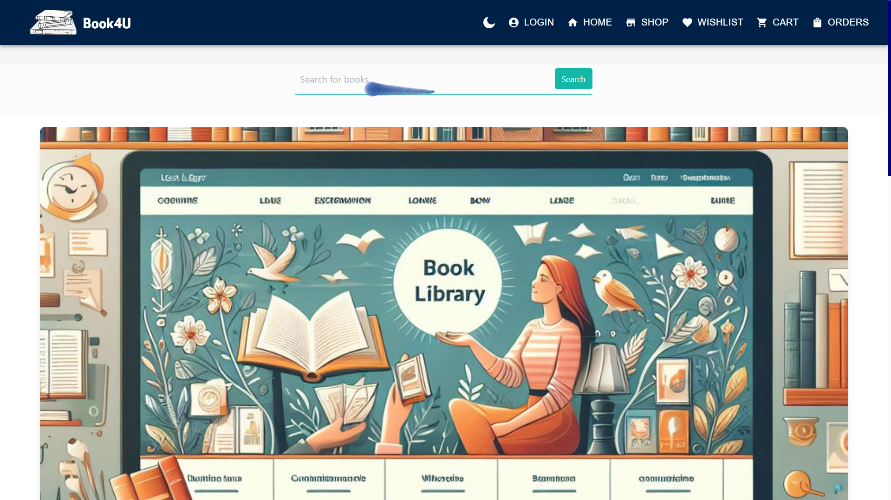

<div align="center">

# 📚 Online Book Sales 📚🖌️


</div>

<div align = "center"> 
<br>

<table align="center">
    <thead align="center">
        <tr border: 1px;>
            <td><b>🌟 Stars</b></td>
            <td><b>🍴 Forks</b></td>
            <td><b>🐛 Issues</b></td>
            <td><b>🔔 Open PRs</b></td>
            <td><b>🔕 Close PRs</b></td>
            <td><b>🛠️ Languages</b></td>
            <td><b>👥 Contributors</b></td>
        </tr>
     </thead>
    <tbody>
         <tr>
            <td></td>
            <td></td>
            <td></td>
            <td></td>
           <td></td>
           <td></td>
         <td></td>
        </tr>
    </tbody>
</table>
</div>


<!--Line-->
 


Welcome to **Online Book Sales**, an e-commerce platform where you can browse, purchase, and enjoy a wide range of books from our extensive catalog! Our system is built with a 3-tier architecture, featuring a **MongoDB** database backend, **Node.js** & **Express.js** middleware, and a sleek **React** frontend.




## 📑 Table of Contents

- **[Features](#features)** 🚀
- **[Live Project Links](#live-project-links)** 🌐
- **[Tech Stack](#tech-stack)** 🛠️
- **[Code of Conduct](#code-of-conduct)** 🌟
- **[How to Contribute](#how-to-contribute)** 🤝
- **[How to Run Locally](#how-to-run-the-webpage-on-your-local-system)** 💻
- **[Using GitHub Desktop](#using-github-desktop)** 🖥️
- **[In-Depth Project Analysis](#project-analysis)** 🔍
- **[Our Contributors](#our-contributors)** 💖
- **[Contact Information](#contact-information)** 📧

---

## Features

- **User Registration & Login**: Secure account creation with user authentication.
- **Browse Books**: Explore our rich catalog with detailed book info.
- **Shopping Cart**: Easily add, update, or remove items.
- **Order History**: View your past purchases at any time.

---

## Live Project Links

- **Frontend**: [Book4U](https://book4u-j5au.onrender.com/) 🖱️
- **Backend**: [API Server](https://online-book-sales-backend.onrender.com/) 🌍
<!--line-->


## This project is now OFFICIALLY accepted for

<div align="center">
  
</div>

<div align="center">
  
</div>


<!--line-->


## Tech Stack

| Frontend | Backend | Database |
| :------: | :-----: | :------: |
| [](https://html5.com) | [](https://nodejs.org/) | [](https://www.mongodb.com/) |
| [](https://www.w3.org/Style/CSS/Overview.en.html) | [](https://expressjs.com/) | |
| [](https://developer.mozilla.org/en-US/docs/Web/JavaScript) | [](https://reactjs.org/) | |

---

## Code of Conduct

We encourage everyone to be respectful and inclusive. Please take a moment to review our [Code of Conduct](CODE_OF_CONDUCT.md) to help foster a positive environment. 💬

---

## How to Contribute

We welcome all contributions! 🎉 If you'd like to add new features or fix bugs, check out the [Contributing Guidelines](CONTRIBUTING.md) to get started. Fork the repo, clone it, make your changes, and submit a pull request. 

Here’s how to fork the project:

1. **Navigate to the Repository**:
   - Head to the Online Book Sales repository.

2. **Click the Fork Button**:
   - Click on the “Fork” button in the upper-right corner.

3. **Create Your Copy**:
   - Select your GitHub account to fork the repository.

---

## How to Run the Webpage on Your Local System

Follow these steps to run the project on your local machine:

1. Clone the repository:
   ```bash
   git clone https://github.com/Trisha-tech/OnlineBookSales.git
   cd OnlineBookSales
    ```
2. Write the command.

    ```
    npm install
    ```

3. For Frontend
   Go to 'client' directory
   write command

   ```
   npm install
   ```

4. Write the command.

    ```
    yarn start / npm start
    ```

That's it! You’re ready to explore the application locally. 🚀

---
## Troubleshooting

### Common Installation Issues
- **Error: `npm install` fails**: 
  - Ensure that [Node.js](https://nodejs.org/en/download/) and npm are correctly installed on your machine. You can check this by running `node -v` and `npm -v` in your terminal.
  - If you encounter permission issues, try using `sudo npm install` (for macOS/Linux) or running the command prompt as an administrator (for Windows).

### Problems with Starting the Server
- **Error: `Cannot find module 'express'`**:
  - This error usually indicates that the required packages haven't been installed. Make sure to run `npm install` in both the root and `client` directories.
- **Server crashes on startup**: 
  - Check the console logs for any errors that may provide hints about what went wrong. Common issues could be related to incorrect environment variables or database connection strings.

### Issues Related to Dependencies
- **Version conflicts**:
  - Ensure that all dependencies in your `package.json` are compatible. If you see warnings or errors during installation, consider using `npm audit fix` to resolve vulnerabilities.

### FAQs
- **Q: How do I reset my local database?**
  - A: You can drop the existing database and run your migrations or seed scripts again. Make sure to back up any important data before doing this.
  
- **Q: How can I contact support?**
  - A: If you have further issues or questions, please open an issue in this repository, and we'll be happy to help!

### Additional Suggestions
- **Clarity**: Make sure the instructions are as clear as possible. For example, specify where to run commands (in which directory).
- **Links**: If you refer to any external resources (like Node.js downloads), adding hyperlinks could be beneficial.

## Using GitHub Desktop

Alternatively, you can use GitHub Desktop to manage the repository:

1. **Download GitHub Desktop** from [here](https://desktop.github.com/).
2. **Clone the Repository** by signing in to your GitHub account, selecting the repository, and clicking "Clone".
3. **Make Changes**: Edit code locally using your favorite editor.
4. **Commit & Push**: Commit your changes and push them to GitHub via the GitHub Desktop interface.

---

## In-Depth Project Analysis

For a detailed overview of how the project works, please read the [Project Details](PROJECT_DETAILS.md) documentation. This will give you a deep dive into the architecture and design decisions. 🧠

---

## Our Contributors

<h3 align="center">A big THANK YOU to all our contributors! 🙌</h3> 
<div align="center">
  
</div>

---

## Contact Information

If you have any questions or feedback, feel free to reach out via **GitHub**. You can also join our discussion forum.

We look forward to hearing from you! ✨

💙 Thank You !!! 💙
